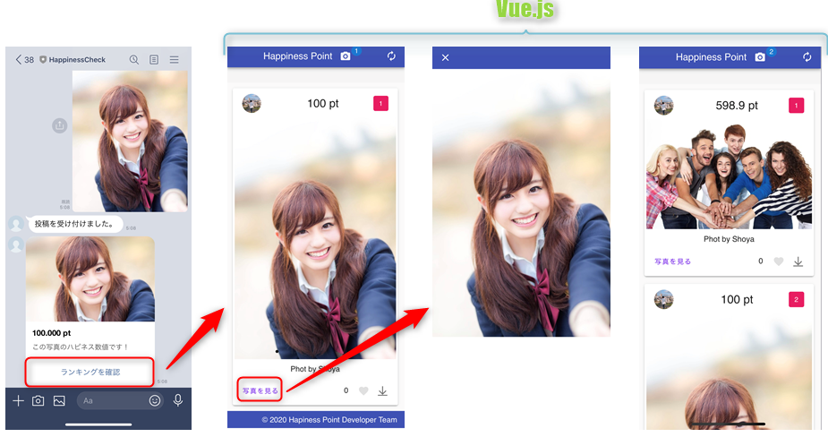
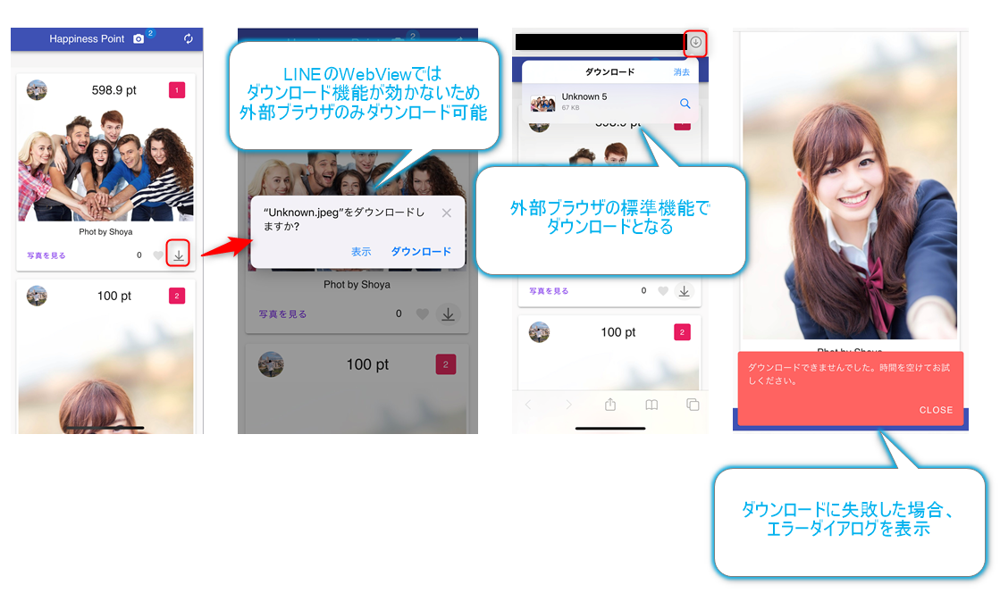
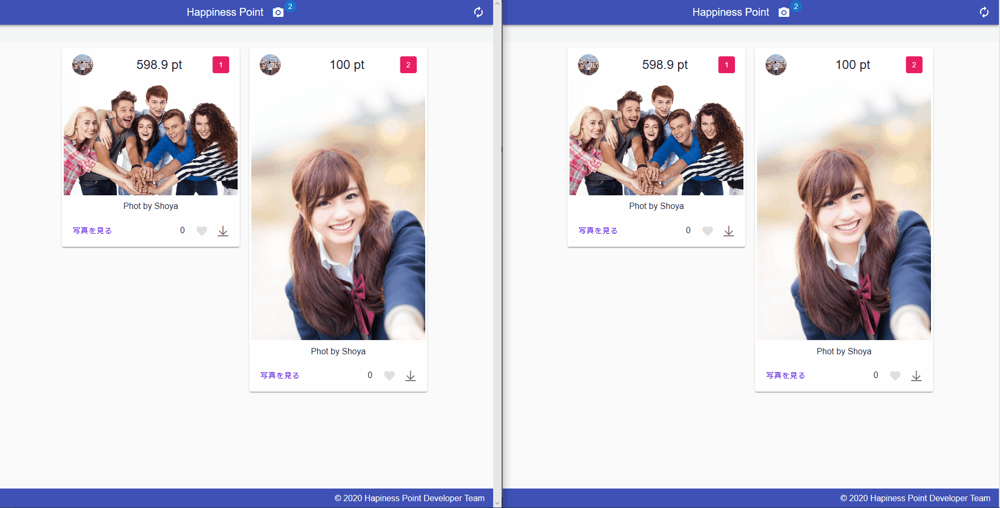
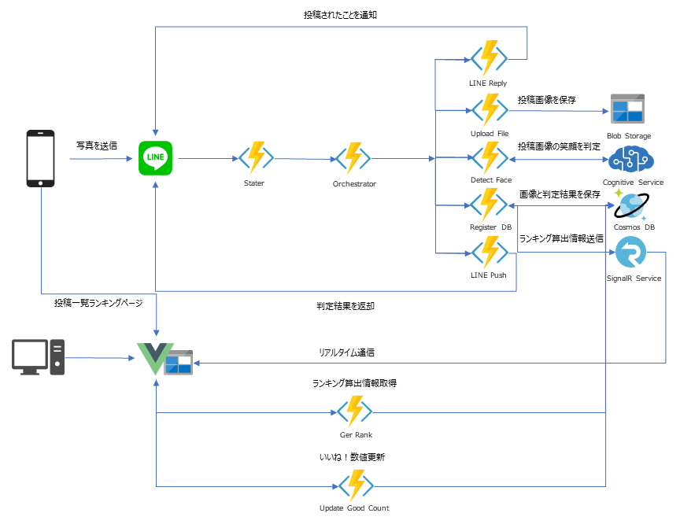
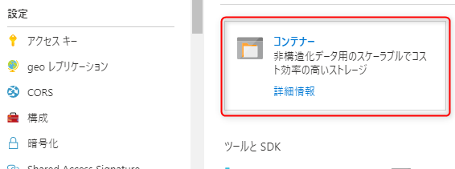
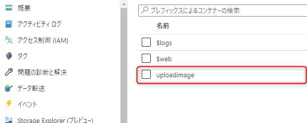
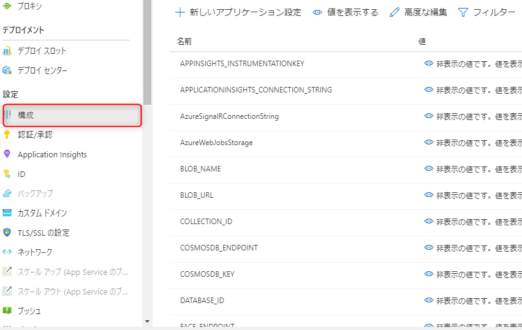
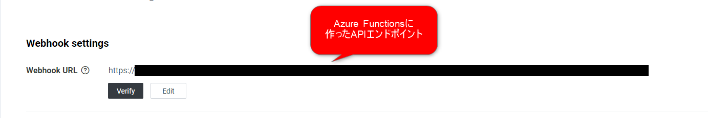

## 詳細

こちらの記事に詳しく書いています。

[AzureとLINEとVue.jsで投稿画像のHappiness数値判定Botを作ってみた](https://qiita.com/yan_tzn/items/42ad4ef678f03ce003aa)

## 動作

【LINEとランキングページ】




【ダウンロード機能】



参加者で投稿画像を共有できるように、ダウンロード機能を設けています


【リアルタイム通信】


ランキングページでは、新しい画像が投稿されたとき、いいね！ボタンが押下されたときに、

ブラウザを更新なしで、変更がリアルタイムで反映されるようにしています


## アーキテクチャ図



Microsoft Azureで構築しており、

LINEとの連携部分は、Durable Functions 、Vue.jsとの連携部分は、AzureFunctions で使用しています。

## 動かすためにやること

### LINE Developers に登録

以下を参照して、登録を行う

* [Messaging APIを利用するには](https://developers.line.biz/ja/docs/messaging-api/getting-started/#%E3%83%81%E3%83%A3%E3%83%8D%E3%83%AB%E3%81%AE%E4%BD%9C%E6%88%90)

チャンネルの作成が完了したら「Channel secret」と「Channel access token」を控えておく

### Azureポータル上の操作

Microsoft Azure で以下を作成する

* Azure Functions
* Azure Cosmos DB
* SignalR
* Cognitive Services Face
* Storage Account

作成をしたら「キー」や「エンドポイント」を控えておく





ストレージアカウントの「BLOB」を使い、「uploadimage」というコンテナーを作成しておく





以降の local.settings.json の項目を AzureFunctions のアプリケーション設定する

その際、SIGNALR_URL は Azure 上に作成した AzureFunctions のエンドポイントを設定する




### Happiness Function (C#)

#### local.settings.json

前述の作業で控えた「キー」と「エンドポイント」を設定する

ローカル実行する場合は、localhost の記載はそのままにしておく

※HOSTの記載は変更しない

```json
{
  "IsEncrypted": false,
  "Values": {
    "AzureWebJobsStorage": "UseDevelopmentStorage=true",
    "AzureSignalRConnectionString": "<your SignalR endpoint>",
    "FUNCTIONS_WORKER_RUNTIME": "dotnet",
    "FACE_SUBSCRIPTION_KEY": "<your faceApi subscription key>",
    "FACE_ENDPOINT": "https://<your faceApi endpoint>.cognitiveservices.azure.com/",
    "STORAGE_ACCOUNT_NAME": "<your storage account name>",
    "STORAGE_ACCESS_KEY": "<your storage subscription key>",
    "BLOB_NAME": "uploadimage",
    "COSMOSDB_ENDPOINT": "https://<your cosmos db endpoint>.documents.azure.com:443/",
    "COSMOSDB_KEY": "<your cosmos db subscription key>",
    "DATABASE_ID": "LineBotDb",
    "COLLECTION_ID": "HappinessInfo",
    "LINE_CHANNEL_ACCESS_TOKEN": "<your LINE Messaging API Access Token>",
    "LINE_CHANNEL_SECRET": "<your LINE Messaging API Channel Secret>",
    "LINE_POST_LIST": "https://<your Storage Static web site endpoint>.z11.web.core.windows.net/",
    "BLOB_URL": "https://<your Strage Account endpoint>.blob.core.windows.net/uploadimage/",
    "PROXY_URL": "https://<your azure function endpoint>.azurewebsites.net/image/",
    "SIGNALR_URL": "http://localhost:7071/api/SendMessage"
  },
  "Host": {
    "LocalHttpPort": 7071,
    "CORS": "http://localhost:8080",
    "CORSCredentials": true
  }
}
```

#### Proxies.json

投稿画像を保存するストレージアカウントのエンドポイントに書き換え

ストレージアカウントを直接外部に表示したくなかったので、プロキシ経由で画像を読み込むようにしています

```json
{
  "$schema": "http://json.schemastore.org/proxies",
  "proxies": {
    "img": {
      "matchCondition": {
        "methods": [ "GET" ],
        "route": "/image/{filename}"
      },
      "backendUri": "https://<your Strage Account endpoint>.blob.core.windows.net/uploadimage/{filename}"
    }
  }
}
```

### happiness_app (Vue.js)

#### prod.env.js

VUE_APP_HOST の書き換え

```js
'use strict'
module.exports = {
  NODE_ENV: '"production"',
  VUE_APP_HOST: '"https://<your azure function endpoint>.azurewebsites.net/api"'
}
```

#### ビルド方法

``` bash
# install dependencies
npm install

# serve with hot reload at localhost:8080
npm run dev

# build for production with minification
npm run build

# build for production and view the bundle analyzer report
npm run build --report
```

## LINEにエンドポイントを設定する

Azure にデプロイした「LineBotHttpStart」のエンドポイントを設定すれば完了



